# Dopamine-Driven Delivery Guardrails + First Live Vector Pipeline

## Why this plan
You derail because the platform gives no fast reward. Legacy gave instant gratification (live orders) but is broken and unsafe (real money, no testnet switch). This plan installs guardrails that guarantee **one visible win per session** while keeping foresight toward profitable algo trading, then revives the trusted `Rsi5ExtremeStrategy` as a real, backtest-gated, tiny-but-real live vector.

Three principles encoded everywhere:
- **Same-session reward**: every session ends with a runnable demo and a logged win.
- **Foresight**: each win is a slice of the real goal (vector -> backtest gate -> live), never a detour.
- **Token economy + safety**: scoped per-context `AGENTS.md`/rules so sessions load only what they need; real-money caps so impulsivity can't blow up the account.

## Decisions locked in
- Live target: **real money, hard-capped tiny size** (~5-6 USD true market-entry notional each), visible in Binance Desktop. Account balance ~102 USDT.
- **Vector cohort: 4 symbols** - DOGEUSDT (~$5.02), XRPUSDT (~$5.06), SOLUSDT (~$5.13), 1000PEPEUSDT (~$5.00). Min entry computed via the `MARKET_LOT_SIZE` filter as `roundUpToStep(max(minQty, MIN_NOTIONAL/price)) * price` (not just `MIN_NOTIONAL`); 521 perpetuals fall in the 5-10 USD band. All four are backtested, compared, and fed to the drawdown-uncorrelated portfolio composer.
- **Strategy (shared): `Rsi5ExtremeStrategy`** - entry RSI(5) cross up through 10, SL = 24h low - ported from [Rsi5ExtremeStrategy.cs](src/legacy/TradingAssistant/TradingAssistant/Rsi5ExtremeStrategy.cs). Legacy TP = `price * (1 + 1/leverage)` is unreachable at 1x (+100% move), so the exit is **redefined as a backtest-tuned fixed price-move TP % (and/or RSI exit)**, finalized in 3a. Each vector = (symbol, long, 4H, this strategy, 1x) via the existing `TradingVectorSpec`.
- **Leverage: 1x, ISOLATED margin** (set at runtime per symbol). Rationale: no historical per-symbol leverage data exists, so backtesting any other leverage is unsound; at 1x the backtest ROI equals the live price-move %, so sim and live match. Isolated caps blast radius to each position's tiny margin.
- **Portfolio composition reuses existing code**: `RunAnalyticsEngine` (ranking + underwater/drawdown Pearson correlation) and `PortfolioComposer` (drawdown-uncorrelated selection) already exist and are chained in CLI `demo`; we feed them 4 real vectors instead of 2 synthetic ones.
- Build location: **TradingPlatform** (greenfield), reusing `TradingVectorSpec` and the simulation/live sink-swap pattern (ADR-003).

---

## Phase 0 - Guardrails (first win, ships same session)
Plug into the existing context system (root [AGENTS.md](AGENTS.md), [.cursor/context/routing-map.md](.cursor/context/routing-map.md)); do not build a parallel system.

- New `.cursor/context/delivery-principles.md`: dopamine-driven delivery norms (one visible slice per session; define the proof/demo up front; timebox; "stop-and-show" checkpoint; keep context lean to save tokens). Linked from root `AGENTS.md` modular-context table and `routing-map.md`.
- New skill `.cursor/skills/ship-a-slice/SKILL.md` + command `.cursor/commands/slice.md` (`/slice`): a start-of-session ritual that picks ONE vector/slice with a concrete visible artifact, lists the smallest steps, and ends by running the demo + appending to the wins log. Encapsulating this as a command also saves re-explaining it each session.
- New `WINS.md` at repo root: append-only streak of shipped visible wins (date, vector, what was visible, proof command). This is the reward ledger - a growing streak you can see.
- New rule `.cursor/rules/live-trading-safety.mdc` (scoped to platform `Execution/**` and `**/Binance/**` order code): real-money guardrails - default disarmed, 1x isolated, per-symbol + total-exposure caps, max concurrent positions = selected count (<=4), daily order cap, kill-switch file, no auto-scaling or arming without explicit per-session confirmation.
- New per-context `AGENTS.md` (the "sub-AGENTS.md" you asked for, currently missing in the platform): `src/platform/TradingPlatform/src/MarketData/AGENTS.md`, `.../Research/AGENTS.md`, `.../Execution/AGENTS.md`, `.../Hosts/AGENTS.md`. Each is short and scoped (purpose, key types, do/don't, verify command) so agents load only the relevant slice.

Visible win: `/slice` runs, `WINS.md` exists with entry #1 (the guardrails themselves), new files are linked from routing.

## Phase 1 - Legacy -> Platform port map (the "analyze ALL features" deliverable)
- New `src/platform/TradingPlatform/docs/legacy-port-map.md`: every good legacy feature -> target platform context -> priority -> the reward it unlocks. Seeded from the inventory already gathered:
  - Realtime kline WebSocket + REST warm-up ([BinanceService.cs](src/legacy/TradingAssistant/TradingAssistant.Infrastructure/Binance/BinanceService.cs)) -> MarketData live feed.
  - Order placement + sizing + SL/TP + leverage config ([TradeHandler.cs](src/legacy/TradingAssistant/TradingAssistant/TradeHandler.cs)) -> Execution adapter.
  - Strategies: `Rsi5ExtremeStrategy` (active) + 6 disabled SMA/RSI strategies -> Research strategies.
  - User-data stream + break-even/trailing/TP managers -> Execution position management (later phase).
  - FASTER candle cache, BTC correlation filter, Telegram, symbol exclusions -> mapped with priority.
- Linked from [.cursor/context/refactor-ledger.md](.cursor/context/refactor-ledger.md) so routing stays lean.

Visible win: a single document that shows exactly what's coming and in what order.

## Phase 2 - Recommended steps to a near result (assessment)
The ordered path to live, each step with its own reward:

```mermaid
flowchart LR
  vec["4 vectors: DOGE/XRP/SOL/1000PEPE long 4H Rsi5Extreme 1x"] --> bt["Phase 3a: Backtest each (real 4H data)"]
  bt -->|"reward: PnL + equity per vector"| pf["Phase 3b: Rank + drawdown correlation + uncorrelated portfolio"]
  pf -->|"reward: comparison + selected set"| feed["Phase 3c: Live multi-symbol 4H feed"]
  feed -->|"reward: live candles + signal eval"| ord["Phase 3d: Tiny REAL orders (armed, capped)"]
  ord -->|"reward: orders in Binance Desktop"| mgmt["Phase 3e: SL/TP follow-ups + Telegram"]
  mgmt -->|"reward: managed positions + pings"| done["Profitable uncorrelated live portfolio"]
```

## Phase 3 - First live vector cohort (gated, incremental)
Each sub-phase is its own session and its own win.

- 3a - Backtest the 4-vector cohort on REAL data (instant reward).
  - Add `Skender.Stock.Indicators` to `Research.Infrastructure`; implement `Rsi5ExtremeStrategy : ITradingStrategy` ([Research.Application](src/platform/TradingPlatform/src/Research/Research.Application)) emitting `OrderIntent`, so the SAME strategy backtests and trades live.
  - Generalize backfill from 1d-only ([BinanceUsdM1dBackfillExchange.cs](src/platform/TradingPlatform/src/MarketData/MarketData.Infrastructure/BinanceUsdM1dBackfillExchange.cs)) to accept an interval (4H); backfill DOGE/XRP/SOL/1000PEPE. The `candles` table already supports multiple timeframes.
  - Redefine the exit for 1x: replace the leverage-based 100% ROI TP with a fixed price-move TP % (sweep a few values) and/or an RSI overbought exit; keep SL = 24h low. Backtest at **1x with fees + slippage** so ROI == price-move %.
  - Run one backtest per symbol; add a machine-readable profitability gate (min trades, positive return, max drawdown, profit factor) persisted per vector.
  - Reward: `backtest` CLI prints PnL/win-rate/equity per symbol + a clear PASS/FAIL verdict for each.

- 3b - Compare cohort + compose uncorrelated portfolio (mostly reuse, big research reward).
  - Feed the 4 run results to the existing `RunAnalyticsEngine` (rank by return; pairwise **underwater/drawdown Pearson correlation**) and `PortfolioComposer` (drawdown-uncorrelated selection) - the same chain CLI `demo` already runs, now with real vectors.
  - Output: a comparison table (return / max DD / profit factor per symbol), the drawdown-correlation matrix, and the **selected uncorrelated set** persisted as a portfolio JSON.
  - Reward: you see which of the 4 are profitable AND uncorrelated, and which set the composer picks for live.

- 3c - Live multi-symbol 4H market-data feed (reward: see it move).
  - New `ILiveCandleFeed` port in `MarketData.Application` + Binance.Net socket adapter in `MarketData.Infrastructure` (port the multi-symbol kline-subscribe pattern from legacy `BinanceService`), subscribed to the selected portfolio symbols.
  - Host worker (replace `StartupProbeHostedService` in [Program.cs](src/platform/TradingPlatform/src/Hosts/TradingPlatform.Host/Program.cs)) that logs each closed 4H candle and evaluates the strategy per symbol; include startup replay of the last closed candle so it evaluates immediately, not in 4 hours.

- 3d - Tiny REAL orders for the selected portfolio, armed and capped (the big dopamine).
  - Replace [LoggingLiveOrderIntentSink.cs](src/platform/TradingPlatform/src/Execution/Execution.Infrastructure/LoggingLiveOrderIntentSink.cs) with a real Binance USD-M adapter behind `ILiveOrderIntentSink` (market entry + StopMarket SL, ported from `TradeHandler`), wired through the existing `PortfolioExecutionRouter`.
  - Before any order, set **1x leverage + ISOLATED margin** for the symbol (Binance.Net `ChangeInitialLeverageAsync` + `ChangeMarginTypeAsync`). Compute qty at runtime from live exchange info using the **`MARKET_LOT_SIZE`** filter: `qty = roundUpToStep(max(minQty, MIN_NOTIONAL / price), stepSize)` (overriding the strategy's 10% margin), and **reject the order if the resulting entry notional exceeds the per-symbol `MaxNotionalUsd`**.
  - Enforce `LiveTradingOptions`: `Armed=false` default, `MaxLeverage=1`, per-symbol `MaxNotionalUsd` (~5-10 USD), `MaxTotalNotionalUsd` (~40 USD), `MaxConcurrentPositions` = selected count (hard cap 4), daily order cap, kill-switch file.
  - Live arming requires each traded vector's latest backtest verdict to be PASS and the symbol to be in the selected portfolio.
  - Add a guarded CLI `fire-test-order --symbol <S>` (tiny, capped, requires `--arm`) so you can see one real order in Binance Desktop on demand without waiting for a 4H signal.
  - Reward: real orders for the selected symbols appear in the Binance Desktop app.

- 3e - Follow-up management + notifications (**todo #12 `slice-management`**, deferred).
  - Port user-data stream + SL/TP management and Telegram alerts from legacy managers.
  - Documented in [ADR-008](../../src/platform/TradingPlatform/docs/ADRs.md#adr-008--first-live-vector-cohort-guarded) consequences; see [legacy-port-map.md](../../src/platform/TradingPlatform/docs/legacy-port-map.md) P1.

---

## Safety rails for real money (non-negotiable)
- **1x leverage, ISOLATED margin only** - never raised (no historical leverage data to backtest, and isolated caps loss to each position's margin).
- Disarmed by default; arming is explicit and per session.
- Per-symbol `MaxNotionalUsd` + `MaxTotalNotionalUsd` + max concurrent positions (= selected count, hard cap 4) enforced in the adapter, not just config. With ~$5/position and a 4-symbol cap, worst-case committed margin stays well under the ~$102 balance.
- Orders rejected if computed entry notional exceeds the per-symbol cap (guards the `minQty * price` blow-up case).
- Kill-switch file checked before every order.
- Live arming blocked unless the vector's latest backtest verdict is PASS and the symbol is in the selected portfolio.
- No real-money changes land without a build + the documented run command shown to you first.

## Notes / assumptions
- First execution action will be a build smoke-check of [TradingPlatform.slnx](src/platform/TradingPlatform/TradingPlatform.slnx) (not run in plan mode).
- API keys via user-secrets/env, never committed.
- Whether each platform slice goes through a full OpenSpec change or a lightweight `/slice` spike will be decided per slice (spikes stay small; the live-trading capability gets a `trading-platform-execution-*` spec).