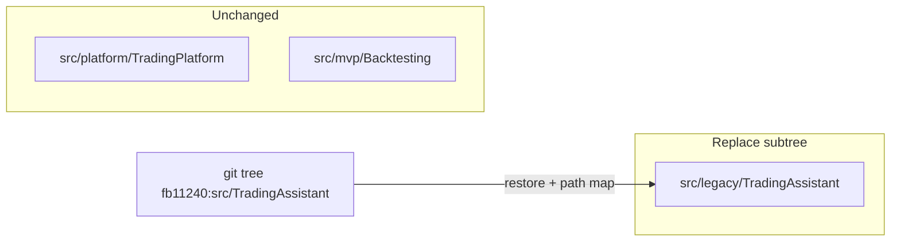

# Legacy monolith restore + OpenSpec cleanup

## Answer: yes, this is feasible

Git history has a **clean breakpoint** between monolith and layered legacy:

| Commit | Date | What changed |
|--------|------|--------------|
| [`fb11240`](fb11240) | 2025-10-15 | Last commit with **only** `TradingAssistant/TradingAssistant.csproj` |
| [`6a3e309`](6a3e309) | 2025-10-15 (+3 min) | Adds Domain, Application, Infrastructure, Worker |

`src/platform` and `src/mvp` live on **different paths**, were added **after** the monolith era, and have **no solution references** to legacy. Replacing only `src/legacy/TradingAssistant/` does not require touching them.



**Your choices (confirmed):**
- **Structure:** single-csproj layout from `fb11240`, **not** a byte-for-byte snapshot
- **Toolchain:** bump to **net10** + aligned packages (Binance.Net 12.11.x, EF Core 10, MediatR 14, etc.) to match repo conventions
- **OpenSpec:** delete **entire legacy track**; Platform specs/archives only

---

## Phase 1 — Restore legacy code tree

### 1.1 Replace subtree from git

```powershell
# From repo root
Remove-Item -Recurse -Force src/legacy/TradingAssistant
git checkout fb11240 -- src/TradingAssistant
Move-Item src/TradingAssistant src/legacy/TradingAssistant
```

Resulting layout (~55 source files):

```
src/legacy/TradingAssistant/
├── TradingAssistant.sln          # single project
├── .dockerignore
└── TradingAssistant/
    ├── TradingAssistant.csproj
    ├── Program.cs
    ├── BinanceService.cs
    ├── TradeHandler.cs
    ├── *Strategy.cs, *Manager.cs, *Worker.cs
    ├── TradingContext.cs + Migrations/
    ├── Dockerfile, appsettings*.json
    └── ...
```

**Removed permanently** (post-`fb11240` legacy work):
- `TradingAssistant.Domain|Application|Infrastructure|Worker`
- Entire `CandlestickData.*` bounded context + tests
- All layered refactor commits through today

### 1.2 Modernize packages / TFM (structure-only restore)

Update [`src/legacy/TradingAssistant/TradingAssistant/TradingAssistant.csproj`](src/legacy/TradingAssistant/TradingAssistant/TradingAssistant.csproj) to align with root [`AGENTS.md`](AGENTS.md) stack:

| Package | fb11240 | Target |
|---------|---------|--------|
| TFM | net9.0 | **net10.0** |
| Binance.Net | 11.8.0 | **12.11.x** (per [binance-net skill](.cursor/skills/binance-net/SKILL.md)) |
| EF Core | 9.0.9 | **10.0.2** |
| MediatR | 13.0.0 | **14.0** |
| Skender.Stock.Indicators | 2.6.1 | **2.7.1** |
| Microsoft.Extensions.Hosting | 9.0.9 | **10.x** |

Fix any **Binance.Net 12 breaking API** compile errors in `BinanceService.cs` and related files (follow existing Infrastructure patterns in current codebase before deletion, or binance-net skill).

### 1.3 Verify build

```bash
dotnet build src/legacy/TradingAssistant/TradingAssistant.sln
```

`.vscode/launch.json` already points at `net9.0` DLL path — update to `net10.0` after TFM bump. [`tasks.json`](.vscode/tasks.json) builds the sln and stays valid.

**EF migrations:** monolith migrations live **inside** `TradingAssistant/Migrations/` (not Infrastructure). Update docs to:

```bash
dotnet ef migrations add <Name> --project src/legacy/TradingAssistant/TradingAssistant
dotnet ef database update --project src/legacy/TradingAssistant/TradingAssistant
```

---

## Phase 2 — Delete legacy OpenSpec track

Per your decision: **delete all legacy specs and archives**; keep Platform only.

### DELETE — main specs (7 directories)

| Directory | Why obsolete |
|-----------|--------------|
| [`openspec/specs/architecture`](openspec/specs/architecture) | Mandates 4-layer Clean Architecture + separate CandlestickData API |
| [`openspec/specs/candlestick-data-service`](openspec/specs/candlestick-data-service) | Separate deployable service never existed in monolith |
| [`openspec/specs/candlestick-gap-governance`](openspec/specs/candlestick-gap-governance) | Written for CandlestickData bounded context |
| [`openspec/specs/exchange-integration`](openspec/specs/exchange-integration) | Describes `IExchangeService` / Infrastructure layer |
| [`openspec/specs/market-data`](openspec/specs/market-data) | Assumes CandlestickData REST integration |
| [`openspec/specs/trading-strategies`](openspec/specs/trading-strategies) | Written for layered Host/Application split |
| [`openspec/specs/risk-management`](openspec/specs/risk-management) | Same |

### DELETE — archived changes (7 directories)

| Archive | Why obsolete |
|---------|--------------|
| [`2026-06-09-legacy-clean-architecture-refactor`](openspec/changes/archive/2026-06-09-legacy-clean-architecture-refactor) | Directly promotes the layer split being undone |
| [`2026-06-09-cqrs-candle-repository`](openspec/changes/archive/2026-06-09-cqrs-candle-repository) | Shipped CandlestickData CQRS — no longer in codebase |
| [`2026-06-09-legacy-backtesting-module`](openspec/changes/archive/2026-06-09-legacy-backtesting-module) | Layered legacy backtest — superseded by Platform |
| [`2026-06-09-legacy-multi-broker-support`](openspec/changes/archive/2026-06-09-legacy-multi-broker-support) | Frozen legacy proposal |
| [`2026-06-09-legacy-event-driven-dca`](openspec/changes/archive/2026-06-09-legacy-event-driven-dca) | Frozen legacy proposal |
| [`2026-06-09-legacy-risk-management-v2`](openspec/changes/archive/2026-06-09-legacy-risk-management-v2) | Frozen legacy proposal |

### KEEP — Platform OpenSpec (unchanged)

**Main specs (4):**
- `trading-platform-marketdata-instrument-registry`
- `trading-platform-marketdata-candles-store`
- `trading-platform-marketdata-binance-1d-backfill`
- `trading-platform-research-backtest-cli`

**Archived changes (4):**
- `2026-04-17-marketdata-usdm-1d-candle-backfill`
- `2026-04-25-marketdata-usdm-backfill-unicode-symbol-fix`
- `2026-06-09-marketdata-instrument-identity-and-candles-registry`
- `2026-06-10-trading-platform-research-backtest-cli`

**MVP:** no OpenSpec exists today — nothing to delete.

### Rewrite [`openspec/README.md`](openspec/README.md)

Remove the entire "Legacy reference" section, supersession map, and legacy routing. Document Platform-only track.

---

## Phase 3 — Update repo docs and agent routing

Files that **must** change because they describe layered legacy / CandlestickData / legacy OpenSpec:

| File | Change |
|------|--------|
| [`AGENTS.md`](AGENTS.md) | Legacy = **single-project monolith reference**; remove Domain/Application/Infrastructure table; fix EF migration commands; remove "mid-refactor Clean Architecture" status for legacy |
| [`src/README.md`](src/README.md) | Legacy row: single csproj, no CandlestickData; fix build/test/migrate commands |
| [`.cursor/context/refactor-ledger.md`](.cursor/context/refactor-ledger.md) | Legacy role = frozen reference monolith; remove legacy OpenSpec track table |
| [`.cursor/context/routing-map.md`](.cursor/context/routing-map.md) | Remove legacy OpenSpec / layer AGENTS routing |
| [`docs/legacy/trading-assistant.md`](docs/legacy/trading-assistant.md) | Rewrite architecture diagram to single project; drop layer AGENTS links |
| [`src/legacy/TradingAssistant/TradingAssistant/AGENTS.md`](src/legacy/TradingAssistant/TradingAssistant/AGENTS.md) | Replace or simplify — only one project remains (delete sibling layer AGENTS.md files with the projects) |
| [`.vscode/launch.json`](.vscode/launch.json) | `net9.0` → `net10.0` program path |

**Review / likely trim** (reference deleted OpenSpec or layered legacy):
- [`docs/archive/legacy-clean-architecture-refactor.md`](docs/archive/legacy-clean-architecture-refactor.md) — archive doc about refactor being undone; consider delete or add "superseded by monolith restore" note
- [`.cursor/rules/architecture.mdc`](.cursor/rules/architecture.mdc), [`ddd.mdc`](.cursor/rules/ddd.mdc) — scope to Platform only if they mention legacy layers
- [`src/platform/TradingPlatform/docs/legacy-port-map.md`](src/platform/TradingPlatform/docs/legacy-port-map.md) — **keep** (maps behavior to Platform contexts; still valid as porting guide, just points at monolith files now)

**Unchanged:**
- All of `src/platform/TradingPlatform/**`
- All of `src/mvp/Backtesting/**`
- Platform cursor skills, live-trading-safety rules

---

## Risks and trade-offs

1. **~8 months of legacy evolution discarded** — CandlestickData, gap governance service, clean-architecture extraction, Worker split, legacy tests.
2. **Binance.Net 11→12 compile fixes** required after package bump (expected; monolith code is inline `BinanceService`).
3. **Behavioral knowledge** previously in legacy OpenSpec is gone — Platform port map [`legacy-port-map.md`](src/platform/TradingPlatform/docs/legacy-port-map.md) becomes the sole structured reference for "what to port from legacy."
4. **No rollback without git** — this is a deliberate subtree replacement; commit should be atomic and message should state intent.

---

## Verification checklist

- [ ] `dotnet build src/legacy/TradingAssistant/TradingAssistant.sln` succeeds
- [ ] `dotnet build src/platform/TradingPlatform/TradingPlatform.slnx` still succeeds (unchanged)
- [ ] `dotnet build src/mvp/Backtesting/Backtesting.sln` still succeeds (unchanged)
- [ ] `openspec/specs/` contains only 4 `trading-platform-*` directories
- [ ] `openspec/changes/archive/` contains only 4 platform archives
- [ ] Grep for `CandlestickData`, `TradingAssistant.Domain`, `legacy-clean-architecture` in active docs returns only historical/archive hits
