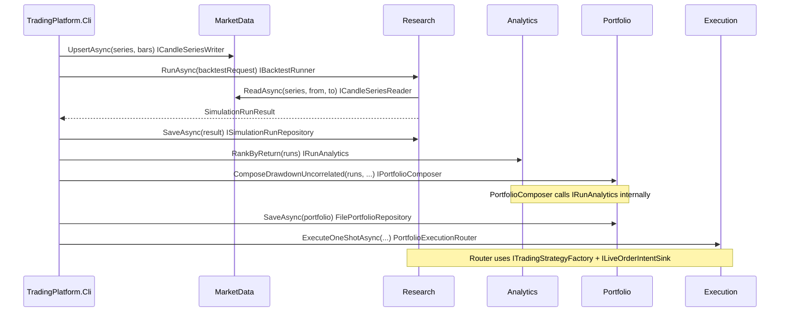

# End-to-end alignment review

## Learning objective

Prove the **CLI `demo`** flow is explainable as **cross-context collaboration**: every arrow in your sequence diagram maps to a **concrete interface or type** in the codebase.

## Prerequisites

- [12-delivery-host-and-cli.md](./12-delivery-host-and-cli.md)

## Workshop: acceptance checklist

- [ ] Each message in the sequence diagram has a **named** API (interface method or public type) in repo.
- [ ] Each participant maps to a **bounded context** from [GLOSSARY.md](../GLOSSARY.md).
- [ ] Ambiguities become **ADR candidates** or issues.

## Compare with repo — demo script

Source: [TradingPlatform.Cli/Program.cs](../../src/Tools/TradingPlatform.Cli/Program.cs) (`RunDemoAsync`).

| Step | Narrative (your words) | Code anchor |
|------|------------------------|-------------|
| 1 | Seed candle series | `ICandleSeriesWriter.UpsertAsync` |
| 2 | Run simulation A | `IBacktestRunner.RunAsync` → internally `ICandleSeriesReader.ReadAsync` ([BacktestRunner.cs](../../src/Research/Research.Infrastructure/BacktestRunner.cs)) |
| 3 | Run simulation B | same |
| 4 | Persist runs | `ISimulationRunRepository.SaveAsync` |
| 5 | Rank by return | `IRunAnalytics.RankByReturn` |
| 6 | Compose portfolio | `IPortfolioComposer.ComposeDrawdownUncorrelated` (uses `IRunAnalytics` inside) |
| 7 | Save portfolio | `FilePortfolioRepository.SaveAsync` |
| 8 | Route execution | `PortfolioExecutionRouter.ExecuteOneShotAsync` |

**Note:** Research **depends on MarketData at runtime** via `ICandleSeriesReader` inside `BacktestRunner`; the CLI does not call `ICandleSeriesReader` directly for the backtest step. Reflect this on your context map (Research → MarketData query).

## Workshop: sequence diagram (Mermaid starter)

Edit labels to match your ubiquitous language; keep **interfaces** in the notes.

## Gaps and resolutions (fill)

| Gap you notice | Resolution (ADR / code / doc) |
|----------------|------------------------------|
| | |

## Open questions / ADR candidates

- Should CLI **inject** explicit `ICandleSeriesReader` for clarity in demos, or is Research-only access acceptable?
- E2E test harness: future `dotnet test` covering the diagram vs manual `demo` only.

## Trail complete

Return to [00-how-to-use-this-trail.md](./00-how-to-use-this-trail.md) to revise earlier docs as understanding deepens.
