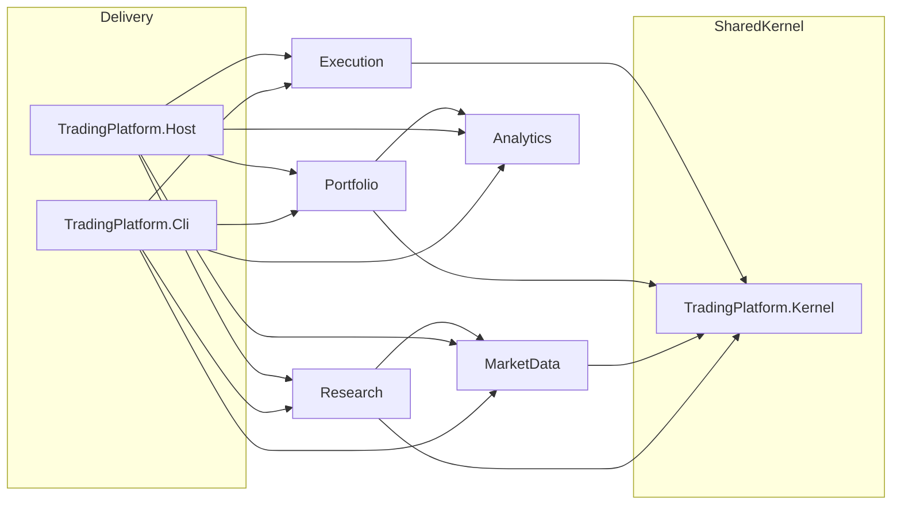

# Context map

## Learning objective

Draw relationships between bounded contexts using **context map** vocabulary (Partnership, Shared Kernel, Customer–Supplier, Conformist, Anti-Corruption Layer, Open Host Service, Published Language, etc.) and tie **each arrow** to a concrete integration in code.

## Prerequisites

- [03-subdomains-and-bounded-contexts.md](./03-subdomains-and-bounded-contexts.md)

## Workshop: relationship table

Fill **your** judgment (relationship type + short rationale):

| Upstream → Downstream | Relationship type | Rationale | Translation point in code |
|----------------------|--------------------|-----------|----------------------------|
| MarketData → Research | | | `ICandleSeriesReader` in [BacktestRunner.cs](../../src/Research/Research.Infrastructure/BacktestRunner.cs); CLI may seed first via `ICandleSeriesWriter` |
| Research → Analytics | | | `SimulationRunResult` / `RunMetrics` |
| Analytics → Portfolio | | | `IRunAnalytics` used inside `PortfolioComposer` |
| Research → Execution | | | `ITradingStrategyFactory` + `PortfolioExecutionRouter` |
| Portfolio → Execution | | | `PortfolioDefinition` + member weights |
| * → Exchange | | | `BrokerAntiCorruptionStub`, `ILiveOrderIntentSink` |
| Kernel ↔ contexts | | | Shared types: `SeriesDescriptor`, `OhlcBar`, `TradingVector`, `OrderIntent`, … |

## Workshop: mermaid (starter skeleton)

Replace placeholders with your relationship labels (e.g. `CustomerSupplier`, `ACL`).

## Compare with repo — integration anchors

| Integration | Interfaces / types | Location |
|-------------|-------------------|----------|
| Candle read/write | `ICandleSeriesReader`, `ICandleSeriesWriter` | `MarketData.Application` |
| Research reads candles | `ICandleSeriesReader` | Used by [BacktestRunner.cs](../../src/Research/Research.Infrastructure/BacktestRunner.cs) |
| Backtest | `IBacktestRunner`, `BacktestRequest` | `Research.Application`, `Research.Domain` |
| Simulation fills | `ISimulationOrderIntentSink` | `Research.Application` |
| Persist runs | `ISimulationRunRepository` | `Research.Application` |
| Analytics | `IRunAnalytics` | `Analytics.Application` |
| Portfolio compose | `IPortfolioComposer` | `Portfolio.Application` |
| Portfolio persist | `FilePortfolioRepository` (concrete in CLI) | `Portfolio.Infrastructure` |
| Live intents | `ILiveOrderIntentSink` | `Execution.Application` |
| Router | `PortfolioExecutionRouter` | `Execution.Application` |
| Broker boundary | `BrokerAntiCorruptionStub` | `Execution.Infrastructure` |

Composition roots: [TradingPlatform.Host/Program.cs](../../src/Hosts/TradingPlatform.Host/Program.cs), [TradingPlatform.Cli/Program.cs](../../src/Tools/TradingPlatform.Cli/Program.cs).

## Open questions / ADR candidates

- Is Execution **Conformist** to Research’s strategy interface, or a **Partnership** if broker rules force strategy shape changes?
- Document **Published Language** explicitly for `PortfolioDefinition` (see XML summary on type in repo).

## Next doc

[05-ubiquitous-language-and-glossary-diff.md](./05-ubiquitous-language-and-glossary-diff.md)
